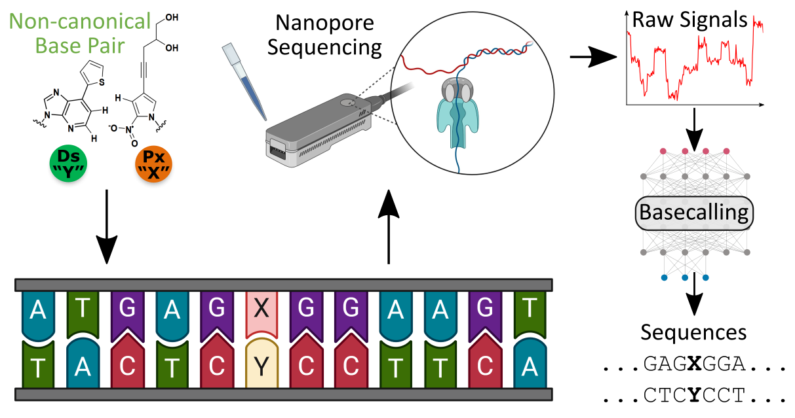

<div align="center">
    
    <!--  -->
</div>

# XNA Basecaller

Code for paper: "Direct high-throughput deconvolution of unnatural bases via nanopore sequencing and bootstrapped learning".

In our work we show how to achieve high-throughput sequencing of DNA containing Unnatural Bases (UBs), a.k.a Non-Canonical Bases (NCBs), using Nanopore and de novo basecalling enabled by spliced-based data-augmentation. The code here contains a basecaller architecture modified for learning to also basecall 1 or 2 additional UBs, and includes real-time data-augmentation for generating train data with UBs in all possible sequencing contexts.

More details in the preprint: https://biorxiv.org/cgi/content/short/2024.12.02.625113v1

```
@article{perez2024,
    author={Mauricio Perez and Michiko Kimoto and Priscilla Rajakumar and Chayaporn Suphavilai and Rafael Peres da Silva and Hui Pen Tan and Nicholas Ting Xun Ong and Hannah Nicholas and Ichiro Hirao and Chew Wei Leong and Niranjan Nagarajan},
    title={Direct high-throughput deconvolution of unnatural bases via nanopore sequencing and bootstrapped learning},
    journal={bioRxiv}, 
    year={2024},
    doi={10.1101/2024.12.02.625113}
}
```

## Setup

### Installation

Download Minimap or create a symbolic link to it at `bin/minimap2`:

```
curl -L https://github.com/lh3/minimap2/releases/download/v2.17/minimap2-2.17_x64-linux.tar.bz2 | tar -jxvf - minimap2-2.17_x64-linux/minimap2
mv -v minimap2-2.17_x64-linux bin
```

Install python enviroment:

```
conda env create -f env.yml
conda activate xna_bc
```

Install UB-Bonito. Recommended to install with xna_bc activated to ensure valid python vesion (v3.9).

```
cd ub-bonito
python3 -m venv venv3
source venv3/bin/activate
pip install --upgrade pip
pip install -r requirements.txt
python setup.py develop
deactivate
```

### Download Data

Run `./download_data.sh` script from the project root directory to download all the necessary files (Total 11GB):

- XNA basecaller baseline model (pre-trained with DNA only)
- Evaluation reads from POC and Complex libraries (fast5 files)
- Pre-processed DNA and XNA train data files (e.g. chunks, references and segmentations)

## Usage

Make sure correct conda enviroment is activated `conda activate xna_bc` and ub-bonito venv3 is **deactivated**.

### Training

Use `train_and_eval.sh` to run basecaller training and evaluation. See file for more options available.

Quick runs:

- Spliced:
    - `./train_and_eval.sh POC training/spliced-ubs_X-data_0.01-ub_prop_0.10 ub-bonito/bonito/data/dna_r9.4.1/sampled_0.01/ 0.10 -u X -b 98 -e 1 -m per_kmer`
- Hybrid:
    - `./train_and_eval.sh POC training/hybrid-ubs_X-data_0.01-ub_prop_0.10 ub-bonito/bonito/data/dna_r9.4.1/sampled_0.01/ 0.10 -u X -b 98 -e 1`
- Fully-synthetic:
    - `./train_and_eval.sh POC training/fully_synth-ubs_X-data_0.01-ub_prop_0.10 ub-bonito/bonito/data/dna_r9.4.1/sampled_0.01/ 0.10 -u X -b 98 -e 1 -Z`

Final models:

```bash
for UBS in X Y XY; do
./train_and_eval.sh CPLX training/spliced-ubs_$UBS-data_0.25-ub_prop_0.09-unfr_3 ub-bonito/bonito/data/dna_r9.4.1/sampled_0.25/ 0.09 -u $UBS -W -b 98 -m per_kmer -f -F 3 -E POC;
done
```

NOTE: Spliced method real-time train data generation requires many workers to avoid being too much of a bottleneck depending on the batch size chosen. Recommended 32 CPUs (argument `-w 32`) for faster training.

### Evaluation

Use `eval_model.sh` to run ad-hoc basecaller evaluation. See file for more options available.
- `./eval_model.sh POC training/fully_synth-ubs_X-data_0.01-ub_prop_0.10 -b 98 -u X`

### Additional Tools

Compare basecalling performances `src/tools/comp_basecalls_perf.py`
- Ex: `python src/tools/comp_basecalls_perf.py training/*`
- Use `-d` argument to output detailed performance per template and UB position

## Results

Final model performance on POC library:

Method | UB(s) | UB(s) Acc. | DNA Acc.
-- | -- | -- | --
Spliced | X | 77.1% | 91.2%
Spliced | Y | 80.9% | 92.4%
Spliced | XY | 70.6% | 92.3%

## Future vesions

- Training chunks segmentation tool
- UB kmer modeling script and tools
- More utility tools
